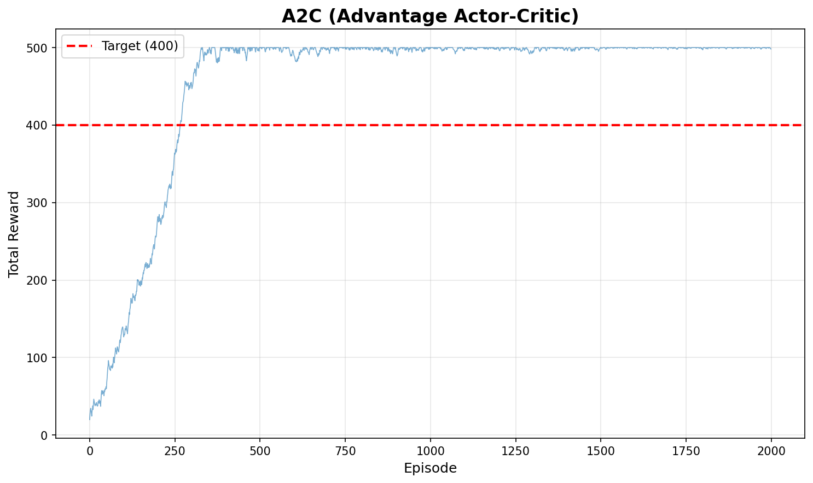
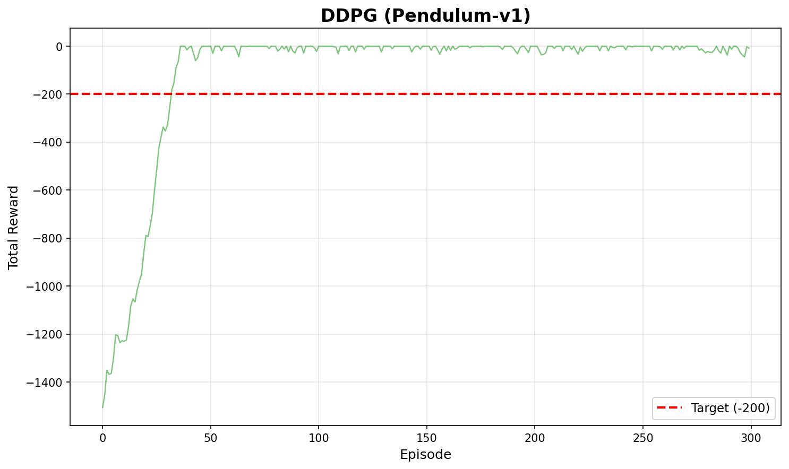

# 강화학습 과제 6주차

발제자: 노유빈

이 과제는 **Actor-Critic 알고리즘 (A2C, DDPG)을 비교**하는 내용입니다.
`a2c.py`, `ddpg.py`를 실행하고 결과를 분석합니다.

### 제출 기한

**2월 23일 (월) 23시 59분**까지

---

## A2C vs DDPG 비교

대상 파일: `a2c.py`, `ddpg.py`

### 구현/작성할 것 (TODO)

- 각 파일의 TODO가 표시된 부분만 작성합니다.
- `a2c.py` 하단의 **질문 1, 2 답변**을 작성합니다.
- `ddpg.py` 하단의 **질문 3 답변**을 작성합니다.

### 학습 결과 조건

- `a2c.py` (CartPole-v1): 최고 Total Reward **400 이상**
- `ddpg.py` (Pendulum-v1): 최고 Total Reward **-200 이상** (Pendulum은 음수 보상)

그래프에서 기준치를 넘는 구간이 보이도록 학습 결과를 확인합니다.
두 그래프 모두 기준선을 **빨간 점선**으로 표시하며, 실행 시 자동 저장됩니다.

### 실행

```bash
python a2c.py
python ddpg.py
```

---

## 제출 방법

1. TODO 부분 작성 (질문 답변 포함)
2. 두 코드 실행
3. 결과 그래프 이미지를 Week6 폴더에 저장(저장 코드 구현돼 있음)
   (예: `a2c.png`, `ddpg.png`)
4. 기준 Reward 충족 여부 확인

---

## 예시 결과 이미지





---

## 실행 환경 세팅

### 가상환경 활성화(venv, conda 자유)

(예시)

```bash
python -m venv .venv
source .venv/bin/activate
```

### 필수 패키지 설치

Week6 폴더 안의 `requirements.txt`를 사용해서 설치합니다.

```bash
# Week6 폴더에서 실행
pip install -r requirements.txt
```

이미 다른 버전이 설치되어 있어서 에러가 나는 경우 아래처럼 다시 설치합니다.

```bash
# Week6 폴더에서 실행
pip uninstall -y numpy gym gymnasium
pip install -r requirements.txt
```

### gymnasium 사용

최신 환경을 위해 `gymnasium`을 사용합니다.
- A2C: `CartPole-v1` 환경
- DDPG: `Pendulum-v1` 환경 (연속 행동 공간)

---

## 알고리즘 개요

### A2C (Advantage Actor-Critic)
- Actor-Critic 구조를 사용하여 정책과 가치 함수를 동시에 학습
- Advantage 함수를 활용하여 분산을 줄이고 학습 안정성 향상
- 이산 행동 공간 (Discrete Action Space)에 적합

### DDPG (Deep Deterministic Policy Gradient)
- Actor-Critic 기반의 연속 행동 공간 알고리즘
- Deterministic Policy를 사용하며, Experience Replay와 Target Network 활용
- 연속 행동 공간 (Continuous Action Space)에 적합

---

## 참고 자료

- 밑시딥4권 chapter 9, 10
- Mnih et al., "Asynchronous Methods for Deep Reinforcement Learning" (A3C/A2C)
- Lillicrap et al., "Continuous control with deep reinforcement learning" (DDPG)
